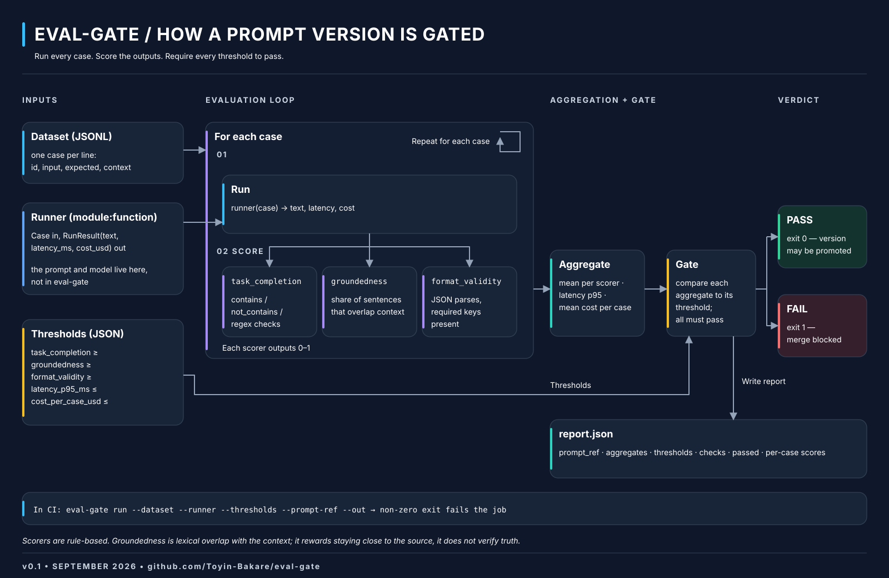

# eval-gate

Score a prompt version against a dataset and pass or fail it against thresholds.
Built to run in CI: exit code 0 means the version may be promoted, 1 means it may not.

Built as a dependency for [ai-foreman](https://github.com/Toyin-Bakare/ai-foreman).
Also works on its own.

## How a version is gated



```
dataset + runner + thresholds → run each case → score → aggregate → gate → exit 0 / 1
```


## Install

```bash
pip install eval-gate
# until it's on PyPI:
pip install "eval-gate @ git+https://github.com/Toyin-Bakare/eval-gate"
```

## Use from the command line

```bash
eval-gate run \
  --dataset examples/cases.jsonl \
  --runner examples.echo_runner:run_case \
  --thresholds examples/thresholds.json \
  --prompt-ref triage@1.2.0 \
  --out report.json
```

Output:

```
eval-gate PASS  triage@1.2.0  3 cases
  ok   task_completion      1.0        threshold 0.9
  ok   groundedness         1.0        threshold 0.6
  ok   format_validity      1.0        threshold 1.0
  ok   latency_p95_ms       120.0      threshold 8000
  ok   cost_per_case_usd    0.001      threshold 0.02
  report -> report.json
```

## The three inputs

**Dataset** — JSONL, one case per line:

```json
{"id": "t1", "input": "FAILED test_login - got 401",
 "expected": {"contains": ["401"], "format": "json", "required_keys": ["cause", "fix"]},
 "context": "source text the answer must stay close to"}
```

**Runner** — a `module:function` that takes a `Case` and returns a `RunResult(text, latency_ms, cost_usd)`.
This is where the prompt and model live. See `examples/gateway_runner.py` for one that calls
[llm-gateway](https://github.com/Toyin-Bakare/llm-gateway).

**Thresholds** — JSON, any subset of:

| Key | Direction | Default |
|---|---|---|
| `task_completion` | mean ≥ | 0.8 |
| `groundedness` | mean ≥ | 0.7 |
| `format_validity` | mean ≥ | 1.0 |
| `latency_p95_ms` | ≤ | 10000 |
| `cost_per_case_usd` | mean ≤ | 0.05 |

## Scorers (each 0–1 per case)

- **task_completion** — share of `expected.contains` / `not_contains` / `regex` checks that pass.
- **groundedness** — share of output sentences whose content words mostly appear in `context`.
  Lexical overlap, not a fact checker.
- **format_validity** — for `format: "json"`, does it parse and have `required_keys`.

Latency and cost come from the runner, not from a scorer.

## Use from Python

```python
from eval_gate import load, run

report = run(load("cases.jsonl"), my_runner, thresholds={"task_completion": 0.9}, prompt_ref="triage@1.2.0")
print(report.passed, report.aggregates)
```

## In GitHub Actions

```yaml
- run: eval-gate run --dataset evals/triage.jsonl --runner app.evals:triage_runner --thresholds evals/thresholds.json --prompt-ref triage@${{ github.sha }}
```

A non-zero exit fails the job, which blocks the merge.

## What v0.1 is and is not

- Scorers are rule-based. No LLM-as-judge, no human review. Both are natural extensions via `SCORERS`.
- Groundedness is a heuristic. It rewards staying close to the source; it does not verify truth.
- Runs cases one at a time, no retries. Fine for datasets of 10–50 cases.

## Develop

```bash
pip install -e ".[dev]"
ruff check src tests examples
pytest -q
```

## License

MIT
